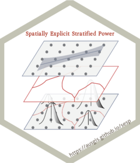

``` r
library(showtext)
showtext_auto(enable = TRUE)
font_add("ShineTypewriter", regular = "./ShineTypewriter-lgwzd.ttf")
library(hexSticker)
library(magick)

sticker(
  subplot = "./fig_sesp.png",
  s_x = 1.005,
  s_y = 0.955,
  s_width = .6,
  s_height = .6,
  package = "Spatially Explicit Stratified Power",
  p_family = "ShineTypewriter",
  p_size = 5.5,
  p_x = 1.00,
  p_y = 1.60,
  p_color = ggplot2::alpha("#aa3322",1),
  dpi = 300,
  asp = 1,
  h_size = 2.55,
  h_color = ggplot2::alpha("#c3c3b4",1),
  h_fill = '#ffffff',
  white_around_sticker = F,
  url = "https://stscl.github.io/sesp",
  u_color = ggplot2::alpha("#3e3221",.75),
  u_size = 5.45,
  filename = "sesp_logo.png"
)

image_read('./sesp_logo.png') |> 
  image_resize("240x278")|> 
  image_write('./sesp_logo.png')
```



**I would like to extend my sincere gratitude to [my
girlfriend](https://github.com/layeyo) for her invaluable assistance in
designing the foundational sesp figure.**
